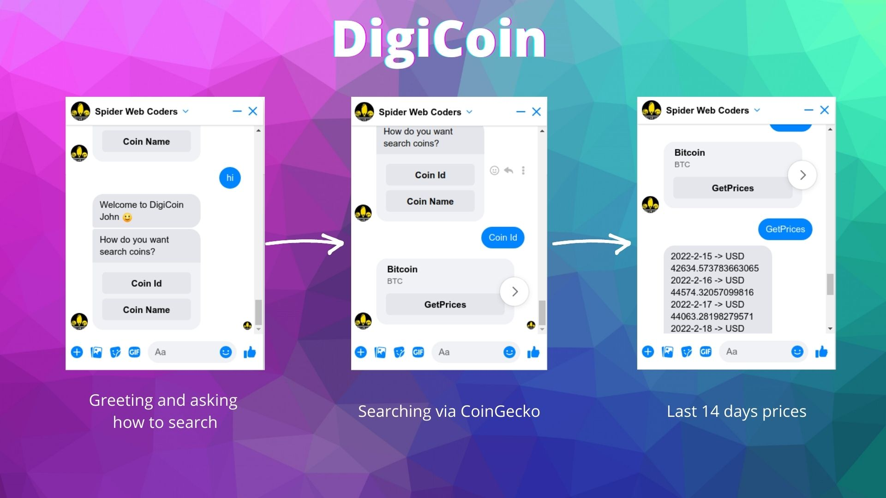

# Welcome MindValley DigiCoin




## Development Technologies

At the moment of developing this project, I used the following versions of
Elixir and Erlang.

```elixir
iex> mix hex.info

Hex:    1.0.1
Elixir: 1.13.0
OTP:    24.0.4

Built with: Elixir 1.13.0 and OTP 22.3
```
## Export System variables
The following variables are required to be exported

```sh
FACEBOOK_PAGE_ACCESS_TOKEN = <page_access_token>
FACEBOOK_WEBHOOK_VERIFY_TOKEN = <random_string used while adding webhook>
```

# Running Application
#### mix release digi_coin

```
mix deps.get
mix release digi_coin
```

I added the releases path to `./releases` 

So, we are provided with following commands.

```
Release created at releases!

    # To start your system
    releases/bin/digi_coin start

Once the release is running:

    # To connect to it remotely
    releases/bin/digi_coin remote

    # To stop it gracefully (you may also send SIGINT/SIGTERM)
    releases/bin/digi_coin stop

To list all commands:

    releases/bin/digi_coin

```


#### iex -S mix

Running Interactively

# Receiving Transaction Updates as Webhooks

## Expose a local web server to the internet

The `ngrok` will allow local webserver running to internet. So, we can use our local webserver url as webhook url at `blocknative`.

run the following command

```shell
ngrok http 4000
```

You will see the following output.

```
Session Status                online
Version                       2.3.40
Region                        United States (us)
Web Interface                 http://127.0.0.1:4040
Forwarding                    http://14fc-136-185-52-176.ngrok.io -> http://localhost:4000
Forwarding                    https://14fc-136-185-52-176.ngrok.io -> http://localhost:4000
Connections                   ttl     opn     rt1     rt5     p50     p90
```

The urls may look different as `ngrok` assigns random hexadecimal names to the HTTP tunnels it opens.  
Here the url is `http://14fc-136-185-52-176.ngrok.io` which will act our webhook base.

Make sure you add `http://14fc-136-185-52-176.ngrok.io/blocknative/webhook` as webhook url for `facebook`.

## Project Challenges

- Framing of Templates and Organizing the modules
- Message Handler for identifying type of web hook events
- Using docker to releases with Elixir.

## TIL

- Learned how to use localhost web server as `webhook` using `ngrok`
- Docker setup for Elixir projects with releases
- Developing and working with facebook developer api messenger

## Overall Project Experience

I felt it is a well framed to test core concepts of Elixir as project made me to code in all the core concepts of Elixir like `GenServers`, `Enumeration`, `collections`, `webhooks`.

## What I enjoyed?

I really enjoyed coding webhooks, playing with docker, and notifying over facebook chat bot.

Thank You :)

Best Regards,
Ankanna
